<!-- ░░ HEADER ░░ -->
<p align="center">
  
</p>

<p align="center">
  <a href="https://x.com/logsofabhi">
    
  </a>
</p>

<p align="center">
  <a href="https://x.com/logsofabhi"></a>
  <a href="https://www.linkedin.com/in/abhishek-kumar12/"></a>
  <a href="mailto:abhishek22512@gmail.com"></a>
  <a href="https://abhishekk.hashnode.dev"></a>
</p>

<br/>

<!-- ░░ ANIMATED TERMINAL ░░ -->
<p align="center">
  
</p>

<br/>

## `$ cat about.yaml`

```yaml
name: Abhishek Kumar
role: AI Engineer @ BrowserStack
focus:
  - LLM evaluation & autonomous eval workflows
  - Agentic workflows that survive real users
  - Model selection: accuracy × latency × cost × stability
  - Production AI infra on AWS / GCP / Kubernetes
background:
  - Data Engineer @ Refyne   # Airflow, 1M+ records/day, SageMaker
  - GSoC @ SPCL, ETH Zürich  # serverless benchmarking, Knative
  - Linux Foundation LiFT Scholar & Dan Kohn Scholarship
philosophy: "A demo is easy. A reliable agent is engineering."
fun_fact: "Coffee makes me sleepy ☕"
```

## `$ ./highlights --sort impact`

<p align="center">
  
</p>

## `$ ls ~/stack`

<p align="center">
  <br/><br/>
  <br/><br/>
  
</p>

<p align="center">
  
</p>

## `$ curl abhishek.prod/status`

<!-- Regenerated every 6 hours from the GitHub API by scripts/generate_status.py (.github/workflows/profile.yml → `output` branch) -->
<p align="center">
  
</p>

<!-- ░░ FOOTER ░░ -->
<p align="center">
  
</p>
